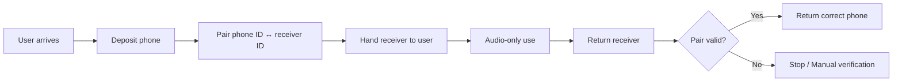
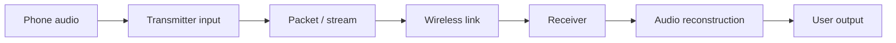
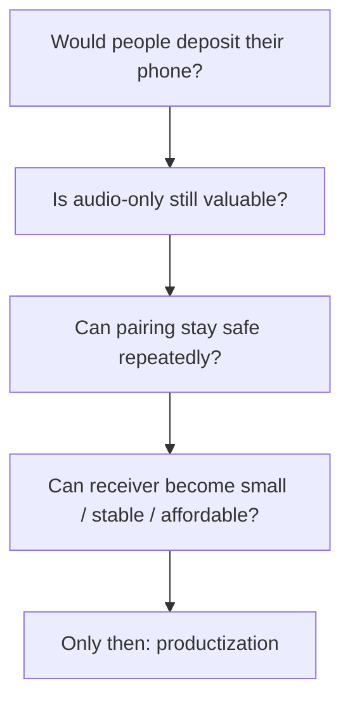

# 🎧 PR1 — Phone ↔ Receiver Exchange

### Keep the audio. Put the screen away.

**휴대폰을 잠시 맡기고 작은 receiver만 받아 사용하는 screen-light audio system.**

  
  
  
  

[Why](#why-pr1) · [System](#the-system) · [Audio](#audio-path) · [Validation](#what-must-be-proven) · [Docs](#docs)

---

> ## `phone in → receiver out → audio only → receiver back → phone back`

PR1은 이어폰을 하나 더 만드는 프로젝트가 아닙니다. 핵심은 **필요한 소리는 남기면서 휴대폰 화면과 물리적으로 거리를 만드는 교환 시스템**입니다.

## Why PR1

공부하거나 걸을 때 음악, 백색소음, 강의, 타이머 같은 소리는 필요할 수 있습니다. 하지만 기존 이어폰은 소리를 들려주는 동안 휴대폰도 계속 손 닿는 곳에 남겨 둡니다.

PR1은 이 문제를 앱 차단이 아니라 **phone deposit + receiver handoff**라는 물리적 흐름으로 풀어보는 실험입니다.

| PR1 is | PR1 is not |
|---|---|
| 휴대폰을 맡기는 교환 시스템 | AirPods / Buds / Shokz 대체 이어폰 |
| audio-only 경험 | MP3 player |
| phone ↔ receiver 안전한 매칭 | 일반 야외 스피커 |
| screen-light 사용 흐름 | tour-guide radio 복제품 |
| product + operation + hardware 실험 | 단순 사용시간 알림 앱 |

## The system

무선 기술보다 먼저 해결해야 하는 것은 **교환과 매칭**입니다.

누구의 휴대폰과 어떤 receiver가 연결돼 있는지 틀리면 제품 전체가 성립하지 않습니다. 실제 서비스 단계에서는 음질보다 먼저 이 pairing integrity가 핵심입니다.

## Audio path

현재 기술 PoC는 다음 흐름을 검증합니다.

ESP32-S3, SX1280, audio module은 **흐름을 검증하기 위한 초기 PoC 도구**이며 최종 제품 부품으로 확정한 것이 아닙니다.

## What must be proven

1. 사용자가 실제로 휴대폰을 맡길 의향이 있는가?
2. 화면 없이 audio만 남겨도 사용 가치가 있는가?
3. 반복 운영에서도 휴대폰과 receiver를 안전하게 매칭할 수 있는가?
4. receiver를 충분히 작고 안정적이며 저렴하게 만들 수 있는가?

이 네 가지가 확인되기 전에는 최종 산업 디자인이나 대규모 구매를 먼저 하지 않습니다.

## Docs

### Product / business

| Document | Purpose |
|---|---|
| `docs/PR1_CANONICAL_POSITIONING.md` | 제품 정의 |
| `docs/WEBSITE_COPY_KR.md` | 공개 설명 문구 |
| `docs/BUSINESS_PLAN_V0.md` | 사업 가설 |
| `docs/MARKET_VALIDATION.md` | 시장 검증 |
| `docs/PILOT_ONE_PAGER_KR.md` | pilot 요약 |

### Technical

| Document | Purpose |
|---|---|
| `docs/TECHNICAL_MVP.md` | MVP 기술 범위 |
| `docs/HARDWARE_ROLE_MATRIX.md` | 부품 역할 |
| `docs/ARCHITECTURE_OPTIONS.md` | 구조 대안 |
| `docs/REGULATORY_GATE.md` | 규제 검토 gate |

---

### 이어폰을 만드는 게 아니라, **휴대폰과 거리를 만드는 교환 시스템**을 만든다.

